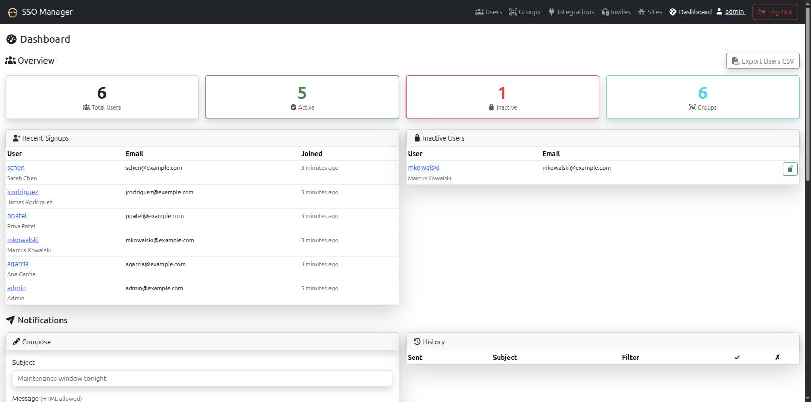

# theta-env

The whole theta42 identity + access stack in one repo, brought up with a single
command — for home labs and small businesses.

It wires together two projects that already work on their own:

- **[SSO Manager](https://github.com/theta42/sso-manager-node)** — an OIDC
  provider with a built-in LDAP directory (OpenLDAP) and a web UI for managing
  users, groups, and OAuth clients.
- **[theta42/proxy](https://github.com/theta42/proxy)** — an OIDC-protected
  reverse proxy (OpenResty) that puts any of your apps behind SSO login and can
  look users up directly in LDAP.

Each project still runs **standalone** (`docker compose up` in its own folder);
this repo just composes them and automates the first-run glue so they find each
other.

**Documentation:** [https://theta42.github.io/theta-env/](https://theta42.github.io/theta-env/)

## Screenshots

The SSO Manager and the proxy it fronts, both stood up by one `./setup.sh` run:

| SSO Manager Dashboard | Proxy Hosts |
| --- | --- |
| [](docs/images/sso-dashboard.png) | [](docs/images/proxy-hosts.png) |

**Why use this instead of running the two separately?** The two only become
useful once the proxy is registered as an OIDC client of the SSO and pointed at
the SSO's LDAP directory — and the SSO's domain has to match across half a dozen
config fields or logins silently fail with `Invalid Credentials`. Doing that by
hand is fiddly and easy to get wrong. `setup.sh` asks for your domain once (in
`setup.env`), generates both config files with it filled in everywhere, registers
the proxy as an OIDC client, and snapshots state before every rebuild — so you
get a working SSO + proxy stack in one command and a safe way to upgrade it.

```
            ┌──────────────────────────────────────────────┐
            │  your browser / apps                          │
            └───────────────┬──────────────────────────────┘
                            │ https
                  ┌─────────▼─────────┐
                  │  proxy            │  OpenResty :80/:443/:4443
                  │  (OIDC + LDAP)    │  mgmt app :3000 (localhost)
                  └─────────┬─────────┘  bundled redis
              ┌─────────────┼──────────────────────┐
              │ ldaps:636   │ http:3001 (internal)│  OIDC token/userinfo
              ▼             ▼                      │
      ┌──────────────────────────┐                │
      │  sso-manager             │◄────────────────┘
      │  OIDC provider + OpenLDAP │  bundled redis
      │  web UI :3001 (localhost) │
      │  ldaps :636 (LAN clients) │
      └───────────────────────────┘
```

The proxy fronts the SSO Manager UI under TLS and protects it with OIDC login.
It is **both** an OIDC client of the SSO (for login) **and** a direct LDAP
client (for user lookups). Legacy apps can still bind to LDAPS on the SSO
directly.

---

## Before you begin

You'll need three things set up ahead of time — a domain, DNS records, and port
forwarding. The setup script can't do these for you; they're outside the host.

### 1. A domain you control

You need a real DNS domain (e.g. `lab.example.com`) because the proxy issues
real TLS certificates for it via Let's Encrypt. A `.local` or made-up name only
gets you a self-signed cert (browsers will warn — fine for testing, painful for
daily use).

The domain is the **one** value you set in `setup.env` (e.g.
`CFG_DOMAIN=lab.example.com`) — see *Quickstart*. The SSO/proxy hostnames
default to `sso.<domain>` / `proxy.<domain>`, and the LDAP base DN
(`dc=lab,dc=example,dc=com`) is built from it automatically.

### 2. At least two hostnames, pointing at your public IP

You need a DNS **`A` record** for each hostname you want the stack to serve,
all pointing at the **public IP** of the host running this stack (or your
router, if the host is behind it). At a minimum:

| Hostname (example) | What it serves |
|--------------------|----------------|
| `sso.lab.example.com`  | The SSO Manager UI (login, user/group/OAuth-client admin). |
| `proxy.lab.example.com`| The proxy's own management UI (add the apps you want to protect). |

Two is the **minimum**. You'll almost certainly want **more**: every app you put
behind the proxy needs *its own* hostname too (e.g. `wiki.lab.example.com`,
`photos.lab.example.com`). Add those DNS records as you add apps — create them
now if you already know what you'll front.

> **Quick local test, no DNS?** You can skip real DNS by adding the hostnames
> to `/etc/hosts` on the machine you browse from, pointing at the stack host.
> The proxy will then fall back to a self-signed cert. Fine for kicking the
> tires, not for real use.

### 3. Port forwarding: 80 and 443 to the host

On your router / firewall, forward these from your public IP to the host
running the stack:

| Port | Why |
|------|-----|
| **80** (HTTP)  | Required for Let's Encrypt to verify domain ownership (ACME HTTP-01 challenge). Without it, you get the self-signed fallback. |
| **443** (HTTPS) | The real traffic — all the UIs and proxied apps. |

Both must reach the host. Port **80 must be reachable from the internet** even
though you'll only *use* 443 — that's just how Let's Encrypt validates. (If you
really can't open 80, the stack still runs on the self-signed cert; you'll just
see browser warnings.)

Optional extra ports (only if you need them):
- **4443** — alternate HTTPS listener (e.g. if 443 is taken by something else).
- **636** (LDAPS) — only if a legacy app on another machine binds to LDAP
  directly over the network. The proxy itself reaches LDAP over the internal
  Docker network, so you do **not** need to expose 636 for the stack to work.

### 4. Docker + Docker Compose

Any recent Docker with Compose — the v2 plugin (`docker compose`) or the v1
standalone (`docker-compose`) both work.

---

## Quickstart

```bash
git clone --recursive https://github.com/theta42/theta-env.git
cd theta-env
cp setup.env.example setup.env     # then edit setup.env: set CFG_DOMAIN to your domain
./setup.sh            # first run: generates ./config/ from setup.env, builds + bootstraps + starts
```

Your domain is entered **once** in `setup.env` (e.g.
`CFG_DOMAIN=lab.example.com`) — the LDAP base DN (`dc=lab,dc=example,dc=com`)
is derived from it, however many labels it has. The
first `./setup.sh` reads `setup.env` and generates `./config/sso-secrets.js` +
`./config/proxy-secrets.js` with that domain filled in everywhere (hostnames
default to `sso.<domain>` / `proxy.<domain>`) plus random secrets, then builds
and brings up the stack in the same run — no edit-and-re-run step.
`setup.env` is used only on that first run; once `./config/*.js` exist they are
operator-owned and `setup.env` is ignored.

`./setup.sh` is idempotent — re-run it any time to converge the stack to
`./config/`. It:

1. Snapshots state to `./backups/<timestamp>/` before rebuilding (config + LDAP
   + both Redis) — a no-op on the very first run.
2. Builds + starts the SSO Manager container, waits for it to be healthy.
3. Runs the bootstrap (`bootstrap/bootstrap.js`) **inside** the SSO container,
   which:
   - creates the LDAP service account the proxy binds as
     (`cn=ldapclient,ou=people,<base>`),
   - creates your first admin user and adds them to the `app_sso_admin` +
     `app_sso_oauth_admin` groups,
   - registers the proxy as an OIDC client in the SSO and **writes the generated
     client id + secret back into `./config/proxy-secrets.js`**.
4. Builds + starts the proxy container, waits for it to be healthy.
5. Registers `<SSO_HOST>` and `<PROXY_HOST>` as Host records in the proxy
   (directly via its Host model, inside the proxy container) — the proxy
   routes every hostname it serves off a Host record, including its own
   management UI and the SSO's UI, so without this step those two URLs
   would 404. Idempotent; skips a host that already exists.
6. Prints your first admin login + the public URLs.

### Configuration — `./config/` (no `.env` files)

All config and secrets live in a bind-mounted `./config/` directory (gitignored),
read by each app's `@simpleworkjs/conf` from a symlinked `secrets.js`:

- **`./config/sso-secrets.js`** — SSO config: `ldap` (base, admin password,
  user/group bases), `oauth` (issuer, `jwtSecret`), `smtp`, `name`, plus
  orchestrator-only `stack` (hostnames, base DN), `bootstrap` (first admin),
  and `serviceAccountPass` (the proxy's LDAP bind password).
- **`./config/proxy-secrets.js`** — proxy config: `oidc` (endpoints,
  `clientId`/`clientSecret` — filled in by the bootstrap), `ldap` (bind creds,
  same `serviceAccountPass`), `auth` (admin groups/users).

`./setup.sh` generates both on first run from `./setup.env` (the one place the
domain is entered — see *Quickstart*) with random secrets. There is **no
`.env` / `proxy.env`** — edit `./config/*.js` directly. Compose only interpolates
port defaults (`SSO_PORT`, `HTTP_PORT`, etc.), which you can override on the
command line: `SSO_BIND=127.0.0.1 ./setup.sh`. See `config.example/` for the
full annotated shape, and each submodule's `secrets.js.example`.

> **Migrating from an older `.env`-based deployment?** If `.env` and/or
> `proxy.env` exist when you first run `./setup.sh`, it migrates them into
> `./config/` **preserving your existing secrets** (LDAP admin pass, JWT, OAuth
> client creds, service pass) so your running deployment keeps its directory,
> tokens, and OAuth client. Afterwards `.env`/`proxy.env` are dead weight —
> delete them.

---

## After setup

- **SSO Manager UI**: `https://<SSO_HOST>` — log in as your bootstrap admin to
  add users, groups, and OAuth clients. (First-run fallback: `http://<host>:3001`,
  reachable on the LAN by default.)
- **Proxy mgmt UI**: `https://<PROXY_HOST>` — add the Host records you want to
  protect with OIDC. (First-run fallback: `http://<host>:3000`, reachable on the
  LAN by default.)
- **Direct LDAP for legacy apps**: bind to `ldaps://<host>:636` as
  `cn=admin,<base>` (admin) or `cn=ldapclient,ou=people,<base>` (read-only
  service account the bootstrap created). Use LDAPS, not plain LDAP.

### API tokens (personal access tokens)

Both apps support **self-service personal access tokens** for calling their
management APIs from scripts/CI/other services without an OIDC browser session.
Each logged-in user mints their own tokens under **API Tokens** in the UI
(the raw token is shown once); a token authenticates **as its creator** and
carries their permissions. Revoke or rotate from the same page (immediate
effect). Tokens persist in Redis (AOF) and survive rebuilds.

```bash
# SSO Manager — manage users/groups/OAuth clients from a script
curl -H "Authorization: Bearer sso_<id>_<secret>" https://<SSO_HOST>/api/user

# Proxy — manage Host records from a script
curl -H "Authorization: Bearer prx_<id>_<secret>" https://<PROXY_HOST>/api/host
```

Format is `<prefix>_<id>_<secret>`; the `id` is the lookup key, the `secret` is
bcrypt-hashed and never stored in plaintext. In the proxy, the creator's group
membership is snapshotted at mint time (revoke + re-mint to tighten after group
changes); the SSO re-resolves groups from LDAP live on each call. See each
submodule's DEPLOYMENT (`sso-manager-node/DEPLOYMENT.md`, `proxy/DEPLOYMENT.md`)
for details.

---

## Logs

The stack runs under Docker Compose with two services — `sso-manager` and
`proxy`. Both the Node app and, for the SSO, OpenLDAP write to the container's
stdout/stderr, so `docker compose logs` is the primary view.

```bash
# Follow both services live
docker compose logs -f

# One service
docker compose logs -f sso-manager
docker compose logs -f proxy

# Last 200 lines and keep following
docker compose logs --tail=200 -f proxy

# Only the last 10 minutes
docker compose logs --since=10m sso-manager
```

The plain container names work too (`docker logs -f sso-manager`,
`docker logs -f proxy`) — handy if you started the stack without Compose.

### Proxy nginx access/error logs

OpenResty writes its access/error logs to files inside the container
(`/var/log/nginx`, on the `proxy-logs` volume), so they do **not** appear in
`docker logs proxy`. Tail them directly:

```bash
docker compose exec proxy tail -f /var/log/nginx/access.log
docker compose exec proxy tail -f /var/log/nginx/error.log
```

### SSO / LDAP logs

slapd runs with `-d 0` and logs to stderr, so LDAP output is already in
`docker compose logs sso-manager`. For a targeted health check, exec into the
SSO and query the directory directly:

```bash
# Your base DN lives in ./config/sso-secrets.js (stack.ldapBaseDn).
docker compose exec sso-manager ldapsearch -x -H ldap://localhost:389 \
  -D "cn=admin,<base>" -W -b "<base>"
```

---

## Backups and restore

`./setup.sh` automatically snapshots state to `./backups/<timestamp>/` **before
every rebuild** and keeps the last `BACKUP_KEEP` (default 5; e.g.
`BACKUP_KEEP=10 ./setup.sh`). Each snapshot has `config/` (your secrets),
`ldap.ldif` (the directory), and `sso-manager.rdb` + `proxy.rdb` (Redis). Back
the `./backups/` directory **off the host** — it holds secrets and the whole
user directory.

### What lives where

| State | Location | Persisted across rebuild? |
|-------|----------|---------------------------|
| LDAP directory (users, groups, policies) | `ldap-data` volume | yes (volume) |
| SSO Redis (OAuth clients, tokens) | `sso-data` volume | yes (AOF + RDB) |
| Proxy Redis (Host records, perms, DNS creds, LE certs) | `proxy-data` volume | yes (AOF + RDB) |
| Secrets (LDAP admin pass, JWT, OAuth client, service pass) | `./config/` | your responsibility — back up off-host |

### Manual backup

```bash
# LDAP (while slapd is running)
docker compose exec sso-manager slapcat -f /etc/openldap/slapd.conf \
  -b "$(docker compose exec -T sso-manager node -e 'console.log((require("/config/sso-secrets.js").stack||{}).ldapBaseDn)')" > ldap.ldif

# Redis — hot snapshot each service
docker compose exec sso-manager redis-cli BGSAVE
docker compose cp sso-manager:/data/dump.rdb sso-manager.rdb
docker compose exec proxy redis-cli BGSAVE
docker compose cp proxy:/data/dump.rdb proxy.rdb

# Secrets
cp -a ./config config-backup && chmod 700 config-backup
```

### Restore — full disaster recovery

```bash
# 1. Secrets
cp -a backups/<ts>/config ./config && chmod 700 ./config
./setup.sh                       # fresh empty volumes
docker compose stop sso-manager

# 2. LDAP — the SSO uses a static slapd.conf (-f, not cn=config -F), so use slapadd -f
docker compose run --rm --no-deps --entrypoint sh sso-manager -c \
  'rm -f /var/lib/ldap/* && slapadd -f /etc/openldap/slapd.conf -l /dev/stdin' \
  < backups/<ts>/ldap.ldif
docker compose start sso-manager

# 3. Redis — delete the AOF first (see note), then load the RDB
for svc in sso-manager proxy; do
  docker compose stop "$svc"
  docker compose run --rm --no-deps --entrypoint sh "$svc" -c \
    'rm -f /data/appendonly.aof /data/appendonly.aof.*'
  docker compose cp "backups/<ts>/${svc}.rdb" "${svc}:/data/dump.rdb"
  docker compose start "$svc"
done
```

> **AOF vs RDB (important):** with `--appendonly yes`, Redis loads
> `appendonly.aof` on startup and **ignores** `dump.rdb` if the AOF exists. To
> restore from an RDB snapshot you **must delete the AOF first** (step 3 does
> this); Redis then loads the RDB and writes a fresh AOF. Verify after restoring:
> `docker compose exec sso-manager redis-cli DBSIZE`,
> `docker compose exec proxy redis-cli DBSIZE`,
> `docker compose exec sso-manager ldapsearch -x -b "<base>"`.

Restore **Redis only** = step 3. Restore **LDAP only** = step 2.

### Upgrades

```bash
git pull --ff-only
./setup.sh          # snapshots, then rebuilds — volumes keep LDAP + Redis state
```
LDAP, both Redis stores, and the auto-ssl Let's Encrypt certs (in proxy Redis)
all survive the rebuild because they live on named volumes, not in the images.
Note: re-running bootstrap resets the bootstrap-admin and service-account
passwords to the `./config/` values; non-bootstrap OAuth clients live in SSO
Redis and are preserved by the volume.

---

## Running each project standalone

The two submodules work on their own — this repo just composes them:

- **SSO Manager alone**:
  ```bash
  cd sso-manager-node
  mkdir -p config && cp secrets.js.example config/sso-secrets.js   # edit it
  docker compose up -d --build
  ```
  See its [DEPLOYMENT.md](sso-manager-node/DEPLOYMENT.md).

- **Proxy alone** (pointing at any external SSO + LDAP via a mounted
  `secrets.js`):
  ```bash
  cd proxy
  mkdir -p config && cp secrets.js.example config/proxy-secrets.js   # edit it
  docker compose up -d --build
  ```
  See its [DEPLOYMENT.md](proxy/DEPLOYMENT.md).

No cross-repo file edits are needed at runtime — the unified stack is pure
composition (one compose file + one bootstrap script).

---

## How the first-run wiring works

`bootstrap/bootstrap.js` runs inside the SSO Manager container (bind-mounted
read-only from this repo) and is deliberately self-contained: it uses only Node
built-ins (`child_process`, `crypto`, `fs`) + global `fetch`. It reads its inputs
from the bind-mounted `./config/sso-secrets.js` + `proxy-secrets.js` (not from
env). LDAP operations use the `openldap-clients` binaries
(`ldapadd`/`ldapsearch`/`ldapmodify`) with explicit admin creds from the config;
the OAuth client is created via the SSO's own HTTP API (logging in as the
bootstrapped admin, which also validates that admin's password end-to-end). It
does **not** `require` the SSO's internal models, so it never has to fight the
app's config layer.

It's idempotent: re-running converges to your `./config/` values. The LDAP
service account + admin passwords are reset to the config on each run; the OAuth
client is created if missing. If `proxy-secrets.js` already holds a
`clientId`+`clientSecret` matching an existing client, they are kept (the proxy
keeps working); otherwise a new client is created (or the secret rotated if the
client exists but the file has no usable secret) and the creds are written back
into `proxy-secrets.js` (the SSO mounts `./config` read-write for this; the proxy
mounts it read-only).

Passwords are stored as `{SSHA512}` (the SSO's `hashPasswordSSHA512`, replicated
exactly in the bootstrap) so the SSO can verify them on bind.

---

## Security notes

1. **Only expose 443 (and optionally 4443) to the internet.** The SSO web port
   (`3001`) and the proxy mgmt UI (`3000`) default to `0.0.0.0` for first-run
   convenience, so they're reachable on your LAN (they're login-protected, but
   it widens the attack surface). The proxy fronts both under TLS in normal
   use, so set `SSO_BIND=127.0.0.1` and `MGMT_BIND=127.0.0.1` to lock them to the
   host once you're up and running (override on the command line, e.g.
   `SSO_BIND=127.0.0.1 MGMT_BIND=127.0.0.1 ./setup.sh`). LDAPS (`636`) is the
   only LDAP listener that should cross the network.
2. **Protect `./config/`.** It holds the LDAP admin password, JWT secret, LDAP
   service password, and OAuth client secret. `setup.sh` writes the files mode
   `0600` and the dir `0700`; the directory is in `.gitignore`. Back it up
   off-host (see *Backups and restore*).
3. **LDAPS uses the SSO's self-signed cert by default.** The proxy binds with
   `ldap.tlsOptions.rejectUnauthorized=false` (in `proxy-secrets.js`). For strict
   trust, this is a **two-step change, not config-only**: (a) edit
   `docker-compose.yml` to also mount the `ldap-certs` volume into the `proxy`
   service (it's currently only mounted into `sso-manager`) — see the
   commented-out boilerplate in the `proxy` service's `volumes:` block — then
   (b) set `ldap.tlsOptions.ca=<path>` in `./config/proxy-secrets.js` to the
   mounted cert path and `docker compose up -d proxy` to pick up the new mount.
4. **Re-running `setup.sh` resets the bootstrap admin + service passwords to
   the `./config/` values.** If you change a user's password in the SSO UI
   later, re-running `setup.sh` will reset the bootstrap admin's password back
   to `bootstrap.adminPass`.
5. Both containers run their app process as root (matching the bare-metal
   systemd units) for simplicity at this scale. Harden to a non-root user for
   a stricter deployment.

---

## Repo layout

```
theta-env/
├── setup.env.example   # first-run config template — cp to setup.env, set CFG_DOMAIN
├── config.example/      # committed annotated config templates (copy to ./config/)
├── docker-compose.yml   # sso-manager + proxy on one bridge net
├── setup.sh             # one-command idempotent bring-up (manages ./config/ + backups)
├── bootstrap/
│   └── bootstrap.js      # runs in the sso-manager container
├── sso-manager-node/    # git submodule
└── proxy/               # git submodule
```

`./setup.sh` reads the gitignored `setup.env` on first run to generate the
gitignored `./config/` (`sso-secrets.js` + `proxy-secrets.js`) and snapshots to
the gitignored `./backups/` before each rebuild.

`./setup.sh` updates both submodules to the latest of their tracked remote
branch before building, so each run builds current upstream — no manual
`git submodule update --remote` needed. To lock to the pinned commits (offline
rebuild, or a deliberate pin), run `SKIP_SUBMODULE_UPDATE=1 ./setup.sh`.