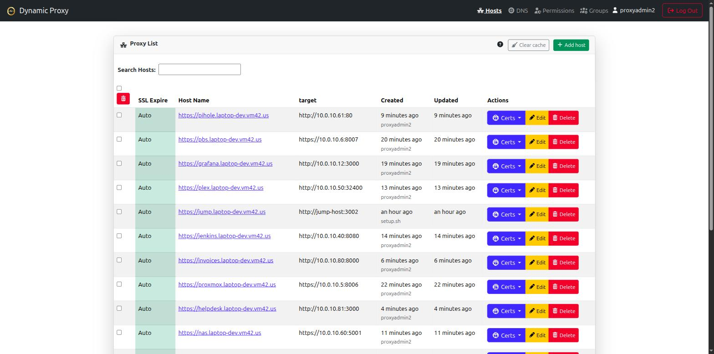

# theta-suite

The whole theta42 identity, access, and secrets stack in one repo, brought up
with a single command — for home labs and small businesses.

It composes four applications around a shared secrets store:
[SSO Manager](https://theta42.github.io/sso-manager-node/) (OIDC provider +
LDAP directory), [Proxy](https://theta42.github.io/proxy/) (an OIDC-protected
reverse proxy that can also look users up directly in LDAP),
[Jump Host](https://theta42.github.io/jump-host/) (directory-driven SSH access
through one public entry point), and
[ldap-client](https://theta42.github.io/ldap-client/) (enrolls your Linux
hosts into the directory for PAM/SSSD, sudo, and SSH keys). All of them read
their secrets at boot from [OpenBao](https://openbao.org/), the central secrets
store. `setup.sh` automates the fiddly part: registering the proxy as an OIDC
client of the SSO, pointing every component at the right LDAP directory and
the OpenBao token it needs, and generating hostnames and secrets from one
`setup.env`.

## Screenshots

The SSO Manager and the proxy it fronts, both stood up by one `./setup.sh` run:

<a href="images/sso-dashboard.png" target="_blank"></a>
<a href="images/proxy-hosts.png" target="_blank"></a>
<a href="images/jump-dashboard.png" target="_blank"></a>

*(click either screenshot to view full size)*

## Why this over running them separately

The components are designed to integrate — they're only useful together once
the proxy is registered as an OIDC client of the SSO *and* pointed at the
SSO's LDAP directory — and the domain has to match across half a dozen config
fields, or logins silently fail. Doing that by hand is fiddly. `setup.sh`
asks for your domain once, generates both apps' config with it filled in
everywhere, registers the proxy as an OIDC client automatically, and
snapshots state before every rebuild.

## What you get

- **SSO Manager**, fronted by the proxy under TLS — manage users, groups,
  and OAuth clients.
- **Proxy** — add the hosts you want to protect with OIDC login.
- **LDAPS** for direct binds — Linux hosts (PAM/SSSD, sudo, SSH keys) and
  LDAP-native apps authenticate against the same directory.
- **ldap-client** — enroll Linux hosts into the directory (PAM/SSSD login,
  sudo, SSH keys); the host inventory shows up in the SSO UI and drives
  jump-host routing.
- **SSH Jump Host** — `ssh uid_-_host@jump.<domain>` (WinSCP-friendly)
  or an interactive picker; access is driven by directory group membership, with
  a web UI for audit + metrics.
- **Central secrets (OpenBao)** — every component loads its secrets from one
  [OpenBao](https://openbao.org/) instance at boot; each user gets personal
  secret storage, and admins mint scoped tokens for external apps. See
  [Secrets](secrets.html).
- **Self-service API tokens** in both apps' UIs, for scripting/CI without a
  browser session.
- **Multi-Site Support (Geo-Location Scaling)** — built-in support for N-Way Multi-Master LDAP replication across physical locations.
- **Multi-target load balancing** — built-in proxy support for round-robin load balancing across multiple application servers.

## Get it

```bash
git clone --recursive https://github.com/theta42/theta-suite.git
cd theta-suite
cp setup.env.example setup.env     # then edit setup.env: set CFG_DOMAIN to your domain
./setup.sh
```

You need **Docker** + **Docker Compose**. `./setup.sh` is idempotent — re-run
any time to converge the stack to `./config/`. For the full config reference,
architecture, and running each project standalone, see the
**[GitHub repository](https://github.com/theta42/theta-suite)**.

## Related projects

- **[SSO Manager](https://theta42.github.io/sso-manager-node/)** — the OIDC
  provider + LDAP directory this stack runs.
- **[Proxy](https://theta42.github.io/proxy/)** — the reverse proxy this
  stack runs in front of it.
- **[Jump Host](https://theta42.github.io/jump-host/)** — the SSH jump
  host this stack brings up.
- **[ldap-client](https://theta42.github.io/ldap-client/)** — enrolls Linux
  hosts into the directory this stack serves.
