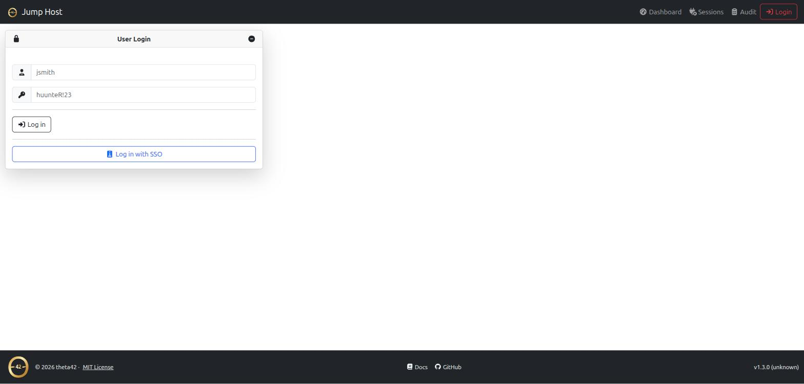
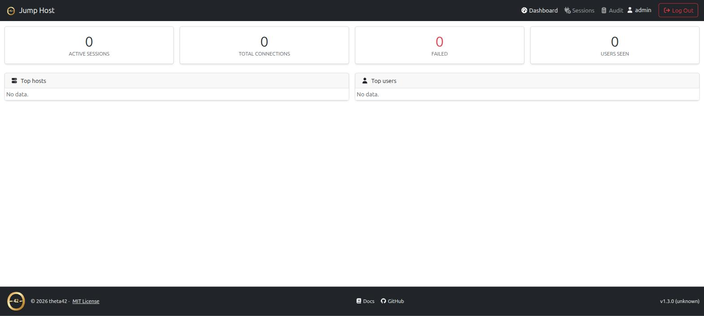
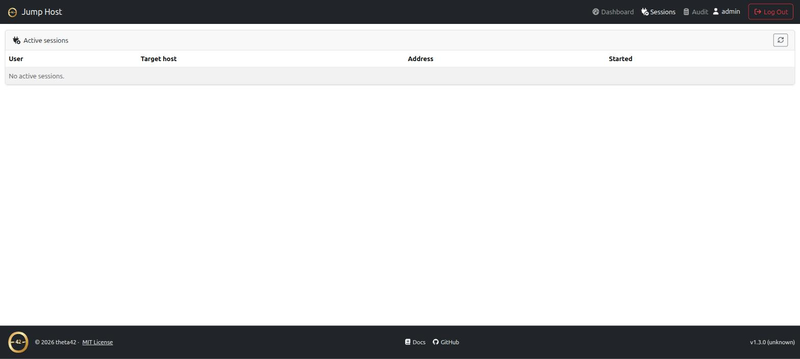
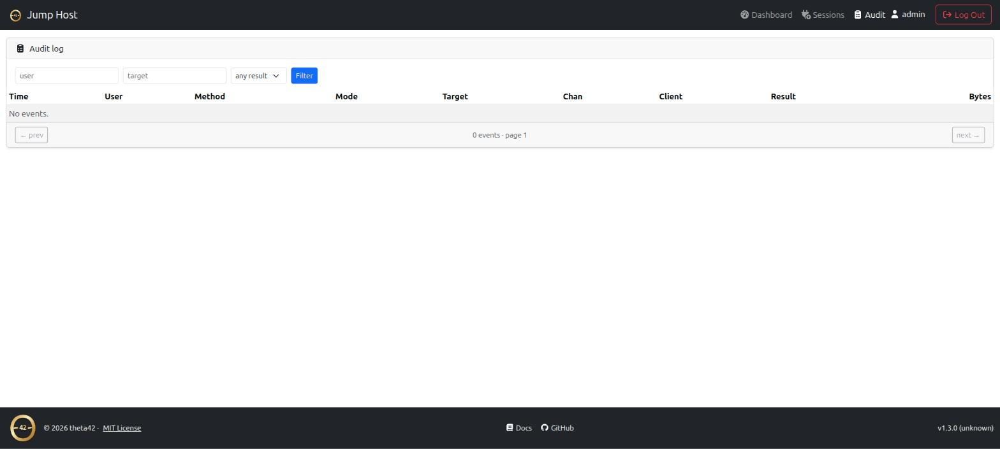

# Jump Host

An SSH jump host for the [theta42](https://github.com/theta42) self-hosted
stack. Users SSH into **one** public host and land on any downstream host
they're entitled to — authenticated against the shared LDAP directory,
authorized from the [SSO Manager](https://theta42.github.io/sso-manager-node/)'s
inventory graph, and audited end to end.

No per-host accounts, no distributing keys, no VPN. The same people who log in
to your SSO are the people who can reach your machines — and only the machines
their directory groups grant.

Part of the theta42 self-hosted identity stack, alongside
[SSO Manager](https://theta42.github.io/sso-manager-node/) and
[Proxy](https://theta42.github.io/proxy/), composable with one command via
[theta-env](https://theta42.github.io/theta-env/).

## Screenshots

<a href="images/login.png" target="_blank"></a>
<a href="images/dashboard.png" target="_blank"></a>
<a href="images/sessions.png" target="_blank"></a>
<a href="images/audit.png" target="_blank"></a>

*(click any screenshot to view full size)*


## Two ways to connect

**Direct (WinSCP/SFTP-friendly):**

```bash
ssh alice_-_web01@jump.example.com
sftp -P 2222 alice_-_web01@jump.example.com
```

The username grammar is `{uid}_-_{target}` — `target` is a directory host slug
(with or without the `host_` prefix), a bare hostname, or an IP. One username
string, no interactive step, so it works cleanly in WinSCP and scripts.

**Interactive picker:**

```bash
ssh alice@jump.example.com
```

A plain login shows a TUI list of the hosts you can reach; arrow-key or type to
filter, Enter to connect.

See **[Connecting](connecting.html)** for the full usage guide.

## Why a jump host (and why this one)

A bastion/jump host is the standard way to give SSH access to internal machines
through a single audited entry point. What's usually painful is *authorization*
and *credentials*: who may reach which host, and how the bastion authenticates
onward without you copying keys everywhere.

This jump host answers both from your directory:

- **Authorization is your directory graph.** The hosts you can reach are the
  union of your LDAP groups × the SSO's inventory (the `host_<name>_access`
  groups the directory already auto-creates). Add someone to a group; they can
  reach the host. No bastion-side allow-list to maintain.
- **Onward auth is automatic.** The jump host holds one key and injects its
  public half into your `sshPublicKey` on first use, then connects downstream
  **as you**. Downstream hosts already serve keys from LDAP (via
  [ldap-client](https://github.com/theta42/ldap-client)'s
  `AuthorizedKeysCommand`), so nothing downstream needs configuring.

## Features

- **Username-grammar routing** (`uid_-_target`) — straight-through to the host,
  SFTP included (WinSCP works)
- **Interactive TUI host picker** on plain login, scoped to your access
- **LDAP inbound auth** — public key or password (keys-only policy recommended
  for a public host)
- **Directory-driven access** — reachable hosts come from the SSO inventory, not
  a static list
- **Per-user key injection** — no downstream changes, no key distribution
- **Shell, exec, and SFTP** bridging
- **Web UI + HTTP API** for auditing and metrics — active sessions, a searchable
  audit log, per-user/per-host counters
- **Full audit trail** — who, target, method, result, bytes, duration, and the
  downstream host-key fingerprint

- Packaged like the rest of the stack: one-command Docker, idempotent bare-metal
  installer, or bundled in theta-env

## Get it

```bash
git clone https://github.com/theta42/jump-host.git
cd jump-host
cp secrets.js.example config/jump-secrets.js   # then edit it
docker compose up -d --build
```

For bare-metal and the bundled theta-env
option, see **[Installation](installation.html)**.

## Related projects

- **[SSO Manager](https://theta42.github.io/sso-manager-node/)** — the OpenLDAP
  directory + OIDC provider + the inventory graph this jump host reads.
- **[Proxy](https://theta42.github.io/proxy/)** — puts your web apps behind the
  same identity; fronts this jump host's web UI.
- **[theta-env](https://theta42.github.io/theta-env/)** — runs the whole stack,
  jump host included, with one command.
